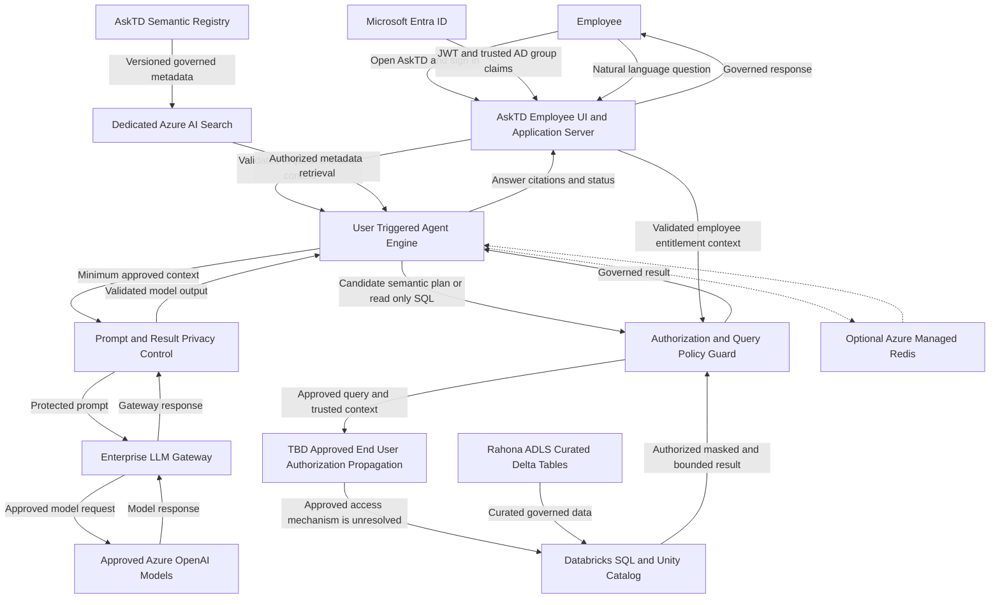
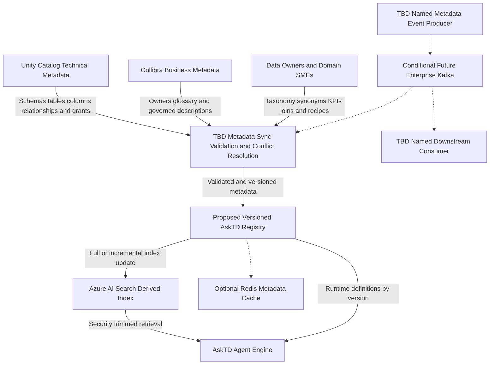
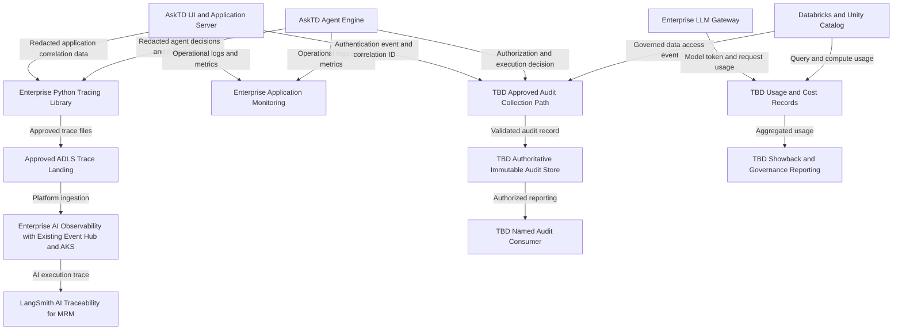
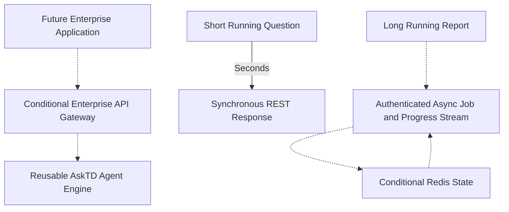

askAlpha — Enterprise Target-State Data Flow Diagram

Prepared: 2026-08-13
Basis: Architect 2 meeting and the established AskTD product context
Status: Architect-aligned target-state draft; not yet architecture-approved

> This document describes the intended production data flows. It deliberately distinguishes confirmed direction, required controls, unresolved decisions, and optional future capabilities. SpruceX is a pre-production validation environment and is not part of the production runtime.

Status legend

• Solid arrow: intended target-state data flow.
• Dashed arrow: conditional, future, or not yet approved.
• TBD node: a decision that must be resolved before production approval.
• Required control node: a security/privacy control required for a safe target design even if the exact implementation is still being finalized.

1. Production runtime data flow

Runtime interpretation

1. The employee authenticates with Entra ID. The application validates the token and derives trusted AD-group/persona context.
2. The Agent Engine runs only in response to a user action; it is not an autonomous background agent.
3. Azure AI Search supplies authorized metadata context. It is a derived index, not the source of truth.
4. Model calls use the enterprise LLM Gateway in the target state. Prompts and any result context must be minimized and protected before leaving the AskTD boundary.
5. Generated SQL is treated as untrusted until the policy guard validates read-only scope, approved objects, limits, and the employee’s entitlement.
6. Unity Catalog must be the authoritative data-platform enforcement point for table, column, row, and masking policies.
7. The exact mechanism that preserves the employee’s authorization while AskTD connects to Databricks is unresolved. A shared Managed Identity plus application filtering alone must not be represented as complete end-user enforcement.
8. Redis is optional/conditional and remains behind the application. It may hold short-lived session, job, and progress state; the browser must not connect directly to it.

2. Metadata lifecycle and indexing flow

Metadata decisions still required

• Confirm which system is authoritative for each metadata category.
• Confirm whether and how Unity Catalog and Collibra are synchronized; the meeting did not establish this as fact.
• Define ownership and precedence when Unity Catalog, Collibra, and AskTD semantic definitions conflict.
• Choose the refresh method: scheduled batch/polling, source notification, or an event-driven process.
• Define how registry, AI Search, and Redis are refreshed or invalidated after metadata or permission changes.
• Security-trim the metadata itself so a user cannot discover unauthorized schemas, tables, or fields.
• Do not add Kafka merely as a placeholder. It requires a named producer, event schema, named consumer, owner, retention/replay need, and approved network path.

3. Observability, audit, usage and cost flow

Separation of concerns

• LangSmith / AI Observability: agent decisions, model calls, latency, errors, token usage, and MRM traceability.
• Operational monitoring: application health, availability, CPU/memory/network, dependency failures, and slow requests.
• Security/data audit: who requested what, effective authorization, governed objects used, query identifier/hash, result size/status, and access outcome.
• Usage/cost: model tokens, Databricks query/compute usage, and product-level showback.

The existing Event Hub shown above is internal to the enterprise AI Observability platform. It is not approval for a separate AskTD business-event backbone.

Full prompts, raw query results, customer identifiers, PII, PCI, access tokens, and unrestricted SQL must not be logged by default. Any exception requires explicit data-classification, masking, access-control, retention, Privacy, Security, and MRM approval.

4. Conditional extensibility paths

• The Agent Engine is kept logically separate so it can later be exposed as an enterprise API, but APIM/API Gateway is not required until another approved application needs it.
• A hybrid request model is recommended: normal synchronous REST for short questions and an authenticated asynchronous job/progress pattern for longer reports. The exact transport and AMR role require performance and security validation.
• A relational application database may be added only when durable application state has a defined requirement; it is not shown as a mandatory runtime dependency.

5. Production trust boundaries and approvals

|Boundary / connection             |Required consideration                                                                                          |
|----------------------------------|----------------------------------------------------------------------------------------------------------------|
|Employee device → AskTD           |Entra authentication, token validation, group-claim handling, session protection                                |
|AskTD UI/server → Agent Engine    |Approved service-to-service identity, trusted user-context envelope, authorization, timeout/retry contract      |
|AskTD → LLM Gateway               |Managed/workload identity, data minimization, filtering, logging policy, cost attribution, gateway readiness/SLA|
|AskTD → Rahona Databricks         |Cross-MAL-code connectivity, JDBC/private network route, WIM review, CPoP/firewall approval                     |
|AskTD user context → Unity Catalog|**Critical unresolved decision:** approved delegated/brokered policy-enforcement pattern                        |
|Unity Catalog → ADLS Delta        |Governed views/external tables, least privilege, row/column/masking policies                                    |
|AskTD → AI Observability          |Approved trace schema, redaction, retention, access, MRM onboarding                                             |
|AskTD → audit destination         |Named audit owner/consumer, immutable storage, retention, correlation, privacy controls                         |

6. Items intentionally excluded from the production runtime

• SpruceX: lower-environment validation with production data and support for MRM approval; not a production hosting platform.
• Synapse copy path: current/interim fallback while Unity Catalog rollout is incomplete; not the preferred target data flow.
• A new AskTD Event Hub: not approved or required for MVP1.
• Enterprise Kafka: conditional future capability only after a concrete producer, consumer, and event requirement are approved.
• Direct browser access to Redis, Databricks, Azure AI Search, or the LLM Gateway: not permitted in this target design.
• Autonomous agents: outside the agreed scope; agents are initiated by user requests.
• Unrestricted direct Azure OpenAI access: a transitional POC path only; the enterprise LLM Gateway is the target direction.
• Claims of zero-copy: the exact cross-environment zero-copy pattern remains unresolved and must be defined separately.

7. Architecture decisions required before this DFD can be approved

1. End-user authorization to Unity Catalog: determine the TD-approved mechanism that preserves the employee’s data scope when AskTD uses a workload/Managed Identity.
2. Metadata ownership: assign authoritative ownership for technical, business, and AskTD-specific semantic metadata and define conflict resolution.
3. Metadata refresh: agree on batch/poll/event triggers and registry/index/cache invalidation behavior.
4. Security audit: define the authoritative sink, schema, retention, owner, and named consumers; keep this separate from LangSmith observability.
5. Privacy controls: define which prompts, metadata, query results, and identifiers can reach the LLM and tracing platforms.
6. LLM Gateway readiness: validate authentication, routing, content filtering, fallback, logging, cost output, SLA, and environment availability.
7. Network topology: approve MAL-code boundaries, private connectivity, CPoP/firewall rules, and service-to-service identities.
8. Long-running requests: validate the synchronous/asynchronous threshold, progress transport, AMR usage, reauthorization, timeout, retry, and disconnect behavior.

────────

Recommended approval wording: This DFD is suitable as the working target-state baseline. Production approval remains blocked on the Unity Catalog end-user authorization pattern, metadata ownership/synchronization contract, security-audit destination, privacy controls, and network/CPoP decisions listed above.
