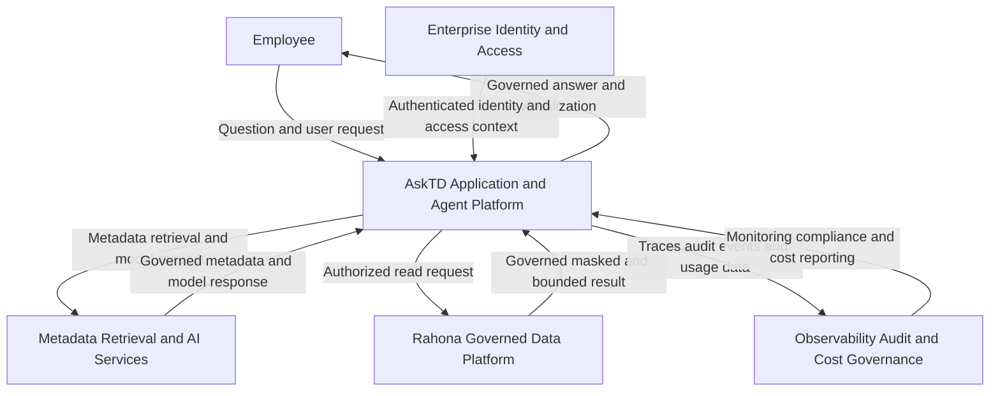

AskTD / askAlpha — Abstract Data Flow Diagram

View: Context / Level 0
Prepared: 2026-08-13
Status: Target-state working draft

This version intentionally hides implementation detail and shows only the major logical systems and data exchanges of the final product.

Logical scope of each block

|Block                                  |Includes                                                                                               |
|---------------------------------------|-------------------------------------------------------------------------------------------------------|
|Employee                               |Internal TD user asking questions and receiving answers                                                |
|Enterprise Identity and Access         |Microsoft Entra ID, JWT validation, AD-group and persona context                                       |
|AskTD Application and Agent Platform   |Employee UI, application server, Agent Engine, authorization guard, query safety and privacy controls  |
|Metadata Retrieval and AI Services     |AskTD semantic registry, Azure AI Search, enterprise LLM Gateway and approved Azure OpenAI models      |
|Rahona Governed Data Platform          |Databricks SQL, Unity Catalog, governed views and curated Delta data in ADLS                           |
|Observability Audit and Cost Governance|Enterprise AI Observability, LangSmith, operational monitoring, security audit and usage/cost reporting|

Main flow in plain language

1. The employee signs in and submits a question to AskTD.
2. Enterprise identity services provide the employee’s trusted identity and access context.
3. AskTD retrieves governed metadata and uses approved AI services to understand and plan the request.
4. AskTD submits a controlled read-only request to the governed Rahona data platform.
5. Rahona returns only the authorized, masked and bounded result.
6. AskTD prepares the final answer, visualization or report for the employee.
7. Operational traces, audit events and usage/cost information are sent to the appropriate governance services.

Decisions intentionally kept outside this abstract view

• The approved mechanism for preserving end-user authorization in Unity Catalog.
• Detailed ownership and synchronization of Unity Catalog, Collibra and AskTD metadata.
• The final security-audit destination, retention and named consumers.
• Redis, APIM and Kafka, because they are conditional implementation choices rather than mandatory Level 0 components.
• SpruceX, because it supports pre-production validation and MRM approval rather than production runtime.

> The detailed DFD should remain the implementation reference. This abstract DFD is intended for architecture discussions, executive review and the first page of an ABP/AVP document.
