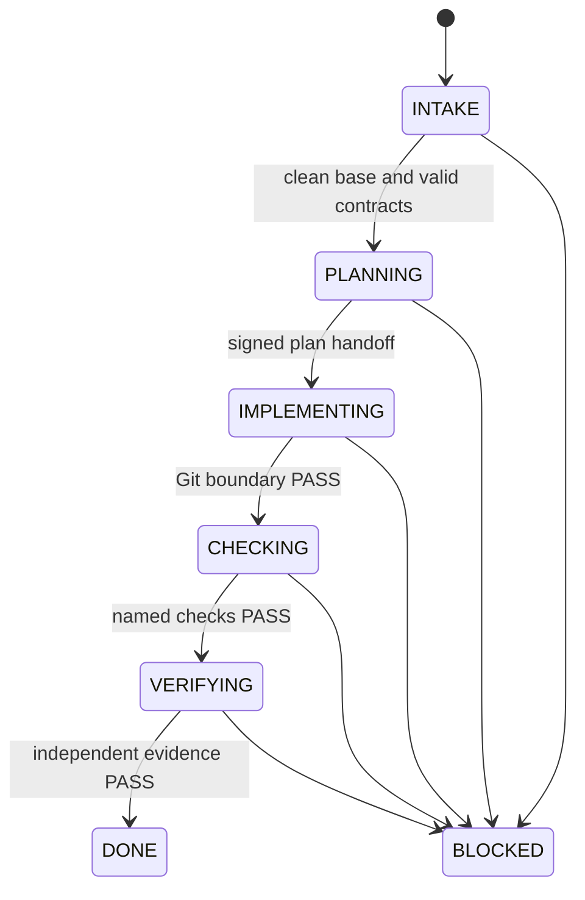

# Complete Local Delivery Design

## Decision

Agent-to-agent handoff is automatic **inside one owner-approved task**. It is not a free-form delegation by one model to another. The Node Orchestrator chooses the next fixed role, launches a fresh OS process and session UUID, verifies a signed structured handoff, and stops on the first unapproved condition.

This design does not need an AI Agent in CI/CD. Local Claude performs semantic planning, implementation, and review. Agentless CI re-runs deterministic qualification after a PR is opened. Deployment remains owned by the organization or environment administrators.

## Control layers

| Layer | Mechanism | Authority |
|---|---|---|
| Product | Roadmap JSON and milestone contract | Owner-approved capability and outcome |
| Architecture | Architecture contract and referenced IDs | Owner-approved boundaries and principles |
| Task | External immutable task contract | Narrow paths, checks, criteria, and exact base SHA |
| Planning | Fresh read-only Planner | Semantic plan; no scope expansion |
| Implementation | Fresh Implementer with file tools only | Writes only approved paths |
| Prevention | Plugin `PreToolUse` command hook | Denies wrong role, stage, path, command, nesting, web, and Git metadata |
| Detection | Git boundary and symlink checks | Canonical changed-path evidence |
| Quality | Exact named checks with `shell: false` | Deterministic compile/lint/test evidence |
| Certification | Fresh read-only Verifier | Reviews exact diff digest; cannot repair |
| Delivery | Human PR/merge plus agentless CI/CD | Outside model authority |

## Implemented task lifecycle



Only a Planner transport failure before mutation may resume automatically. Every post-mutation block requires owner disposition or a separately approved repair task.

## Reusing existing Agents

Existing Agents contain useful domain knowledge, but their existing permissions and names are not accepted as trust evidence.

| Existing asset | Reuse method | Direct lifecycle authority |
|---|---|---|
| Product/program Agent | Move stable outcomes and priorities into roadmap and milestone contracts | No |
| Architecture Agent | Move invariants, boundaries, and ADR references into the architecture contract | No |
| Task-planning Agent | Reuse decomposition rules in `start-milestone`; owner approves the resulting envelope | Planning only |
| Domain implementation Agent | Migrate its domain instructions into the bounded Implementer profile or task context | Implementation only |
| Test/review Agent | Migrate its evidence rules into named checks and Verifier criteria | Verification only |
| Consumer ETL Agents | Keep them inside consumer workspaces and Runtime QA | Never source/release certification |
| Agent owning production and certification | Split its responsibilities before adoption | Blocked until split |

The bundled Planner, Implementer, and Verifier are deliberately small authority wrappers. Domain rules from existing Agents should be incorporated into contracts or one wrapper, not invoked as nested Agents. This preserves prior work without inheriting hidden Bash, web, write, installation, or self-certification authority.

Arbitrary existing Agent profiles are not dynamically selected in version `0.1.0`. Adding that capability safely requires an owner-approved canonical actor registry, exact definition paths and hashes, alias resolution, distinct producer/certifier identities, and a static authority validator. Until those controls exist, copying an Agent name into configuration would create false independence.

## Contract storage rule

Roadmap, architecture, configuration, and milestone sources may be tracked in the target repository. A runnable task contract containing `expectedBaseSha` must be stored outside the target worktree, for example:

```text
C:\lcac-workspaces\etl\tasks\CAP-001-T1.json
```

or in a separate governance repository.

A tracked file cannot contain the SHA of the commit that contains itself. Keeping the task as a sidecar avoids that self-reference. Its digest is frozen in durable run state and signed handoffs; resume fails if it changes.

## Milestone-only supervision target

The current safe release automates role handoff for one task and intentionally leaves the resulting diff uncommitted for owner review. It does not silently claim full milestone autonomy.

Milestone-only supervision requires a later, separately approved integration mode:

1. create an isolated local milestone worktree and integration branch;
2. execute task contracts in dependency order;
3. create local checkpoint commits only after independent PASS;
4. never push automatically;
5. aggregate all task evidence and documentation drift checks;
6. stop at one owner gate for branch publication and PR creation;
7. let agentless CI re-derive deterministic evidence;
8. keep merge, package, install, Runtime QA, deployment, and release human/environment-gated.

That mode must not be enabled by merely looping `run`. It needs explicit milestone authority for local commits, dependency-aware base SHA derivation, crash recovery, and rollback tests. Version `0.1.0` is the safety pilot that must prove reliability first.

## GitHub and CI/CD boundary

No workflow file is installed under `.github/workflows` by this branch. The bundled workflow is only a template. Therefore creating and using the local control plane does not require Actions administration.

The user can work through local changes, branch publication, PR request, and merge. After merge, an administrator can adopt the agentless template and connect required status checks or deployment. Claude credentials and GitHub coding-agent access are unnecessary in CI.

## Completion criteria for the pilot

- at least three low-risk tasks complete without boundary or evidence exceptions;
- every attempted unauthorized path is blocked by the hook and post-Git check;
- Planner, Implementer, and Verifier session IDs are always distinct;
- required checks cannot be changed by model output;
- no post-mutation run is automatically retried;
- owner review finds no undocumented roadmap or architecture drift;
- CI reproduces deterministic checks without Claude.
